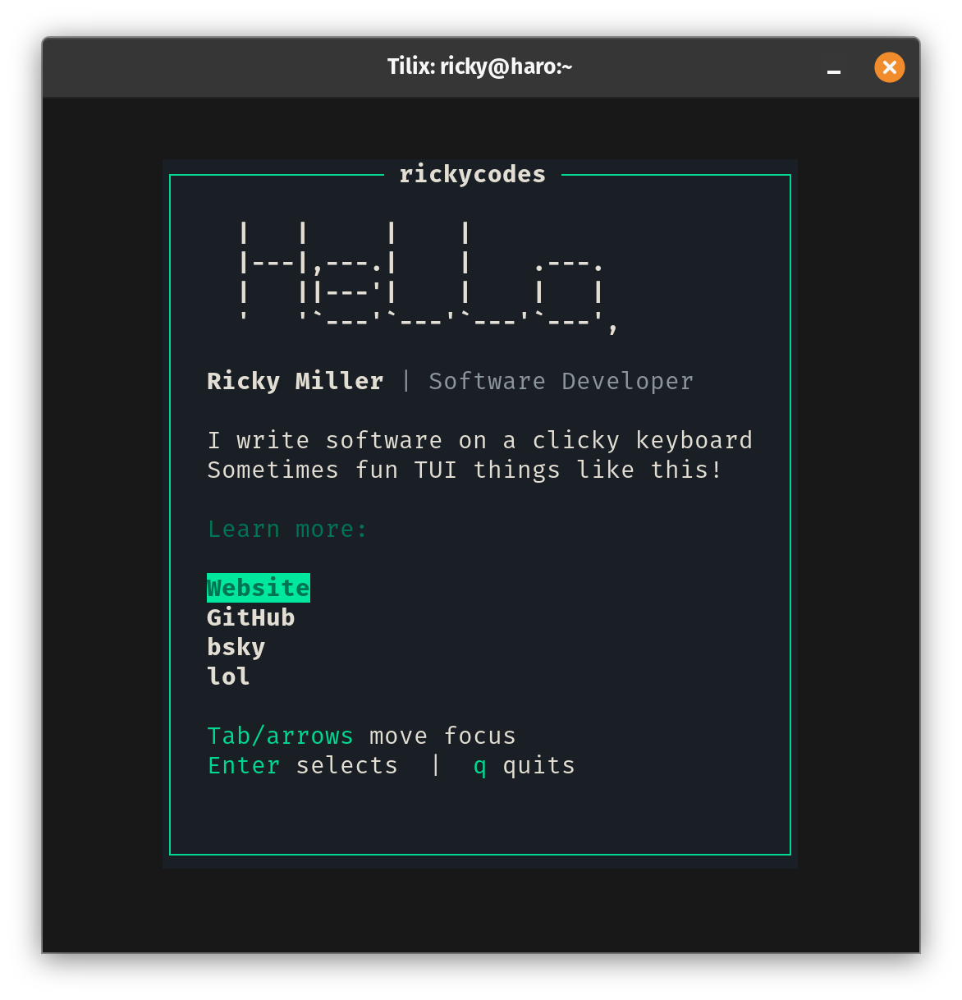

## Goal

Write a CLI in Rust that can still be published to `npm` and launched with `npx`.



## Building

```sh
cargo build --release
```

The native binary is emitted to:

```sh
./target/release/card
```

`npm install` also runs the build automatically through [scripts/install.js](scripts/install.js), so the package remains publishable on `npm`.

## Running

```sh
npx rickycodes
```

The default experience is now a native `ratatui` app. Exit with `q`, `Esc`, or `Ctrl-C`.

To inspect the ANSI palette helper:

```sh
npx rickycodes colours
```

## Packaging tradeoff

`ratatui` requires a real terminal, so this package no longer targets wasm for Node execution. The `npm` package now ships the Rust source and compiles a native binary during install. That preserves the `npm`/`npx` workflow, but consumers need a working Rust toolchain unless you later add prebuilt binaries per platform.

## License

MIT
